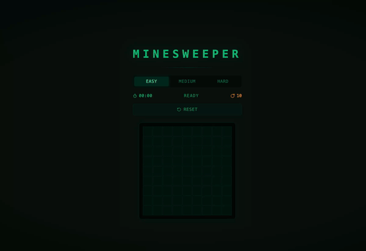

# Minesweeper



## Stack
PHP 8.3 · React · Vite · Tailwind CSS · Framer Motion · nginx · Docker

## Run locally
```bash
cp sample.env .env
docker compose up -d
```

Open http://localhost

## Controls
- **Left click** — reveal cell
- **Right click** — place/remove flag
- **Difficulties** — Easy (9×9, 10 mines) · Medium (16×16, 40) · Hard (16×30, 99)
